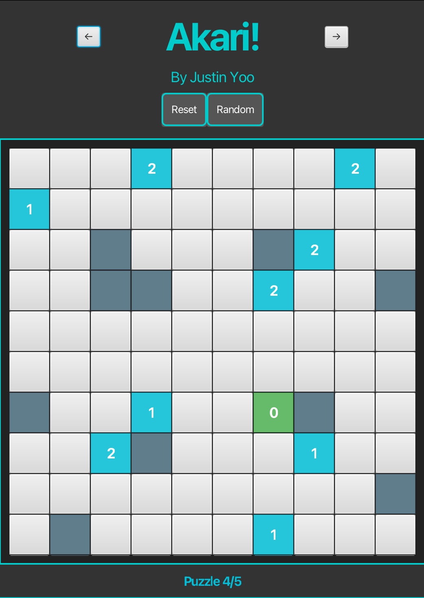

## Akari

### Introduction

This project is a complete, functioning GUI implementation of the single-player logic puzzle, Akari, using the Model-View-Controller (MVC) design pattern along with JavaFX. The goal of this project is to provide a user-friendly interface to solve Akari puzzles while adhering to the MVC structure.

Akari is a puzzle game where the objective is to place lamps in a grid to light up all the corridor cells, while adhering to the puzzle's clues. Each clue cell indicates the number of lamps that should be placed adjacent to it. The game is solved when all corridors are lit, all clues are satisfied, and no lamps are placed illegally.

### Features

- **Grid Layout**: The active puzzle is displayed as a grid where each cell is visually distinguishable as a clue, wall, or corridor.
- **Lamp Placement**: Users can click on corridor cells to toggle lamps. Wall and clue cells are non-interactive.
- **Lighting**: Each lamp lights up its surrounding corridor cells, and the light stops at walls or the edge of the grid.
- **Clue Cells**: Clue cells display numbers indicating how many lamps must be placed around them. A "satisfied" clue is visually distinct from an "unsatisfied" clue.
- **Puzzle Solving**: When a puzzle is solved, a success message appears on the GUI.
- **Reset Button**: A button to reset the puzzle and remove all placed lamps.
- **Puzzle Navigation**: Users can navigate between puzzles using "Next", "Previous", and "Random" buttons.

### Running the Application

To run the application in IntelliJ using Maven:
1. Clone repository: git clone https://github.com/jeyoo2005/Akari
2. Click the vertical "Maven" expansion tab on the right side of the IntelliJ window.
3. Expand the "Plugins" folder.
4. Expand the "javafx" folder.
5. Double-click on "javafx:run" to run the project.

### Architecture

The project follows the **Model-View-Controller (MVC)** pattern:

1. **Model**: Handles the data, including the puzzle grid, lamp placements, and puzzle-solving logic.
    - `ModelImpl`: Implements the `Model` interface and manages puzzle data and logic.
    - `PuzzleImpl`: Represents individual puzzles, including grid layout and clues.
    - `PuzzleLibraryImpl`: A library of puzzles available for the user to solve.

2. **View**: The graphical user interface (GUI) implemented using JavaFX.
    - `AppLauncher`: The entry point of the application, which launches the JavaFX GUI.
    - `FXComponent`: Defines compound UI components for managing different parts of the interface, such as the puzzle grid and controls.

3. **Controller**: Acts as the intermediary between the model and the view, updating the model based on user actions and refreshing the view accordingly.
    - `ControllerImpl`: Implements the controller logic, managing user inputs like lamp placement and puzzle navigation.

### Structure

- **Model**: A working model that tracks lamp placements, verifies puzzle solutions, and manages the puzzle library.
- **View**: A JavaFX interface that displays the puzzle and provides user controls.
- **Controller**: A controller that links the model with the view, responding to user actions like placing lamps and navigating puzzles.
- **Puzzle Library**: A set of pre-coded sample puzzles that the user can solve.

### Puzzle Rules

- **Cells**: The grid contains three types of cells:
    - **Clue cells**: Indicate the number of lamps that must surround them.
    - **Wall cells**: Block the light from lamps.
    - **Corridor cells**: Can hold lamps and must be lit up by them.

- **Lamps**: Lamps can be placed in corridor cells, but not in clue or wall cells. A lamp lights up adjacent corridor cells, and its light is blocked by walls.

- **Clue Cells**: The number displayed on clue cells indicates how many lamps must be adjacent to that cell.
